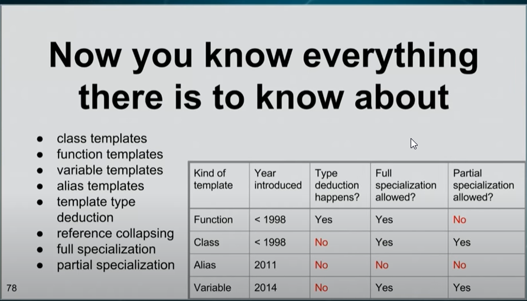

编译期多态

https://www.youtube.com/watch?v=vwrXHznaYLA&ab_channel=CppCon
https://www.youtube.com/watch?v=VIz6xBvwYd8&ab_channel=CppCon
### =========Basic Template programming============
https://www.youtube.com/watch?v=S2OFJe73fxA&list=PLvv0ScY6vfd8j-tlhYVPYgiIyXduu6m-L&index=71&ab_channel=MikeShah

- avoid code copy&paste
- serve as a blueprint for the compiler to generate code for us.
- side effect: code bloat
- "function template" vs. "tempalte function".
  - The term "function template" refers to a kind of template. The term "template function" is sometimes used to mean the same thing, and sometimes to mean a function instantiated from a function template. 
  - This ambiguity is best avoided by using "function template" for the former and something like "function template instance" or "instance of a function template" for the latter. 
  - Note that a function template is not a function. 
  - The same distinction applies to "class template" versus "template class".


上面的截图是2016年的cppcon,在c++17中class template也支持type deduction了
### function template
- https://en.cppreference.com/w/cpp/language/function_template
- function templates **are not functions.** they are templates for making functions
- `template <typename T> T max(T, T);`
- typename关键字
  - template声明的参数列表：用于声明模板参数类型，这个类型在后续可以作为datatype语法使用`template <typename T1, typename T2>`
  - 在template声明/定义体内:用于声明模板参数的从属限定名也为一个datetype
    ```
    template<typename T>
    void printColl(const T& col) {
      typename T::const_iterator pos;
      typename T::const_iterator end = col.end();
      for(pos = col.begin(); pos != end; pos++) {
        std::cout << *pos << std::endl;
      }
    }
    ```
- 可以从参数自动推导出T的data type, 所以可以不用加<>指定模板参数类型
- 可以为类的构造函数和普通成员函数创建function template, 但不能为虚函数和析构函数创建
- function template Specialization
  - 可以提供一个具体化(特化)的函数定义，当编译器找到与函数调用匹配的具体化定义时，将使用该定义，不再寻找模板.`template<> func(params)`, 这样可以为特定类型的数据定义特定类型的逻辑。
  - 函数匹配顺序:普通函数>特化函数模板>主函数模板
  - function template不支持partial specialization.
    如果需要，则通过将函数逻辑代理到class template进行处理，因为class template是可以进行partial specialization的
- 函数模板一般放在头文件中，函数模板只是函数的描述，并没有实体
  - 函数模板的全特化有实体，编译的原理的普通函数一样，所以，声明放在头文件，定义放在源文件
       ```
       .h
       template <typename T>
       T max(T a, T b) {return (a>b)?a:b}
       template<> 
       DogI& max(DogI d1, DogI d2);

       .cpp
       template<>
       DogI& max(DogI d1, DogI d2) {
         return d1.age > d2.age ? d1: d2;
       }
       ```
- template type parameters
    - can have more than one parameters, `template <typename T>`, `template <typename T1, typename T2>`
    - non-type parameters, `template <typename T, std::size_t N> struct array;`
    - can have non parameters, template full specialization:`template <>`
- Variadic function templates, since c++11
  - C, variadic functions:`int printf(const char* fmt, ...)`
- abbreviated function templates (since c++20): `auto square2(auto input) {return input*input;}`
### class template
- https://en.cppreference.com/w/cpp/language/class_template
- class templates **are not classes.** They are templates for making classes.
- the resulting "template classes" follow all the same rulse as normal classes.In particular, each static data member must be defined somewhere if you want to use it.
- 声明时在class前加上`template <typename T>`
- 如果成员函数是在class声明外写函数体，函数体前面也要加上 `template <typename T>`, 并且类名也要加上`<T>`
  ```
  template <typename T>
  class Obj{
  public:
      void print() const;
  }
  template <typename T>
  void Obj<T>::print() const{}
  ```
- 成员函数还可以是另一个个数据类型的template function.`template <typename U>`
- CTAD(since cpp17):Class template argument deduction
- use -Weffc++ with g++ to write effective modern c++
  如果是使用g++进行编译，可以加上-Weffc++选项，编译器会检查代码是否符合effective c++中的项，如果不符合，会warning并给出修改建议
- default paremeters
  - `template <class T, class Deleter = std::default_delete<T>> class unique_ptr`
  - `template <class T, class Allocator = std::allocator<T>> class vector`
- Specialization
  - full specialization
  - partial specialization: is still a template.
    the syntax for a full specialization always starts with template<>. 
    and the syntax for a partial specialization always contains angle brackets after the template-name.
    - partial specialization是介于primary template和全特化之间的，只指定了部分type特性
### Explicit instantiation definition
- instantiation：compiler根据提供的template type parater生成对应的代码。
```
template int abs(int);
template class vector<int>;
template bool is_void<void>;
```
- This special syntax means "Please instantiate this template, with the give template paramters, as if it were being used right here."Semantically, it's not giving the compiler any new information. it's just asking the compiler to instantiate  a definition of the template entity right here.
- **It looks like a full specialization, but without <>** 
- to tell the compiler that you have done this in a different translation unit, and therefore the compiler needn't instantiate this template again in this .o file, just add extern.
```
extern template int abs(int);
extern template class vector<int>;
extern template bool is_void<void>;
```
- DON'T mix use specialization and explicit instantiation for the same template.
- When is instaniation needed?
  - A decent rule of thumb is:Never instaniate anyting you don't absolutely 100% have to.
### Variadic Template parameter deduction
- As far as explicitly specified template parameters are concerned, the first pack-expansion(Args... args) encountered in the template parameter list "soaks up" all the remaining specified template parameters.the type deduction step might wind up lenthening `args`,but will never shorten it.
  ```
  template <typename T, typename... Args, typename V> void f();
  f<int,char,int>(); //T=int,Args=<char,int>, V can not be deduced

  template <typename... Args, typename U> void g(U);
  g<int,char>(3.1); //Ts=<int,char>, U=double(deduced from argument 3.2)
  
  template<typename... Args> void h(Args...)
  g<int,char>(0,0,3.4); //Args=<int,char,double>
  ```
- as far as deduction is concerned, a parameter-pack(Args... args)contributes to deduction only if it comes at the very end of the function paramter list.Otherwise, it does not contribute to deduction.
  ```
  template<typename... Args, typename U>void f(U, Args...);
  f('x', 1, 2); //U=char, Args=<int,int>

  template<typename T, typename... Args>void f(Args... args, T);
  g('x', 1, 2); //args doesn't contribute to deduction, so this fails

  template<typename T, typename... Args>void f(Args... args, T);
  g<int,int,int>('x', 1, 2); //args doesn't contribute to deduction
  //but we explicitly stated T=int,Us=<int,int> which happens to work.
  //必须写全，少一个都不行
  ```
### TODO:template template parameters
-  you need to use template template syntax to pass a parameter whose type is a template dependent on another template like this:
  ```
  //H is a template template parameter
  template <template<class> class H, class S>
  void f(const H<S> &value) {
  }
  ```
### ================Template MetaProgramming================
https://www.youtube.com/watch?v=VBI6TSo8Zog&list=PLWxziGKTUvQFIsbbFcTZz7jOT4TMGnZBh&ab_channel=BitsOfQ
- what is template metaprogramming?
  - the writing of computer programs that manipulate other programs (or themselves) as if they were data.
  - using templated&specializations to do this.
  - in particular we look at 2 things.
    - type traits: to query properties, then combine type traits with `if constexpr` statements to actually choose a different implementation.
    - metafunction:to manipulate types.input and output is type. e.g.
      ```
      template <typename T>
      struct strip_pointer {
        using type = T;
      };
      template <typename T> //partial specialization
      struct stip_pointer<T*> {
        using type = T;
      };
      ```
- metafunction example: check whether one tuple contains specific type.`contains_type`