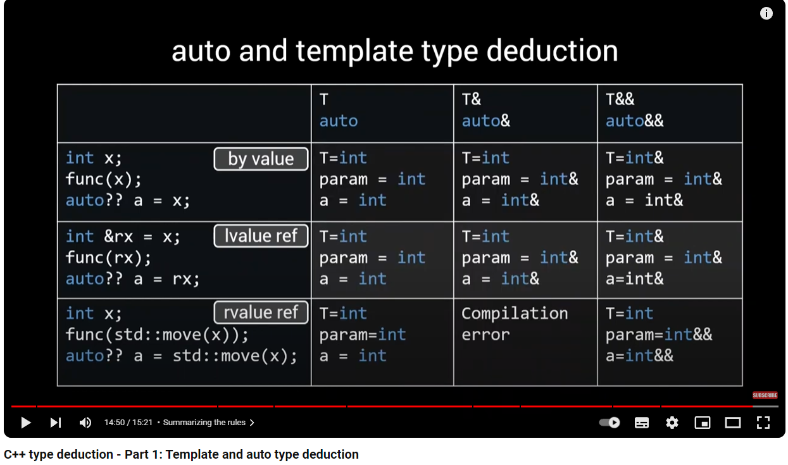

### type deduction
- Usually just works as expected, but not always
- Especially important when writing generic code.
- Errors can be very confusing & bugs are hard to find
- Understanding type deduction is increasingly important in modern C++.

### where is type deduction used?
#### In **C++98** type deduction is used for
- templates
#### In **C++11** type deduction is used for
- Templates， `tempalte<typename T> void foo(T a){}`
- auto variables,  `auto x = 12`
- forwarding references,`template <typename T> void foo(T&& a){}`
- lambda captures and returns, `[&foo]{return false;}`
- decltype, `decltype(expression) var;`  
#### In **C++14** type deduction is used for
- Function return types,`auto function() {return true;}`
- Generic lambdas,`[](auto input){return input+1;}`
- Lambda init captures,`[value=std::move(ptr)]{return *value+1;}`

### Template deduction
```
template<typename T>
void func(T& param);
func(expr);
```
- T: the deduced type
- T&: the type of param
- Using expr, T and the parameter type are deduced.
- The type that is deduced for T depends on the deduced parameter typea
- e.g.
    ```
    const int a;
    func(a);
    T = const int, parameter type = const int&
    ```
- Three cases for deduction of parameter type
  - Parameter type is neither reference nor pointer(pass by value)
    - If expr's type is a reference, ignore that
    - If expr is **top-level** const or volatile, ignore that
  - Parameter type is a reference(or pointer)
    - If expr's type is a reference, ignore that
    - Pattern-match expr's type against the parameter to determine T
  - Parameter type is a forwarding reference
    - if expr is lvalue or lvalue reference of type E. T=E&, parameter is of type E& && => reference collapsing => E&
    - if expr is rvalue(reference), ignore references and pattern-match
  
### auto type deduction
type deduction when using auto works the same as template type deduction in almost all cases. except one case
```
template<typename T>
void func(T param){}

func({1,2,3}); //compile error
auto x{1,2,3}; //compile error 
auto x{1}; //ok
auto x = {1,2,3}; // ok
```


### decltype type deduction
```
decltype(name) - declared type of name
decltype(expression)
decltype(lvalue expression of type T) = T&
decltype(prvalue expression of type T) = T
decltype(xrvalue expression of type T) = T&&
decltype(auto) - same as decltype(name) or decltype(expression) depends on the target
```
- cv is keept
- `decltype(expression) = ...` is equivalent to `decltype(auto) = expression;`

### Type deduction and lambdas

- auto deduction is the same as above explained auto type deduction
- lambda capture deduction, two cases
  - By reference:`[&ca](...){...}`, same rule as Template deduction for ref params
  - By value:`[ca](...){...}`, same rule as template deduction, **but with cv qualifiers**
- lambda init capture deduction:Follows auto deduction rules.
  ```
  auto f = [a={1,2}](){};
  =>
  class name_determined_by_compiler {
    auto a = {1,2}; //deducted to be initializer_list
    void operator(){}
  };
  ```
- auto return type deduction: use template type deduction rules
  ```
    initializer_list will not be deduced.
    auto func() {return {1,2,3};} //compilation erro
  ```
- return type deduction: auto, decltype(auto)
  - auto return type deduction: use template type deduction rules
  - decltype(auto) return type deduction: use decltype rules
  - when to use?
    - Use auto when a reference type should never be returned.
    - use decltype(auto) when a reference type could be a valid return type

  