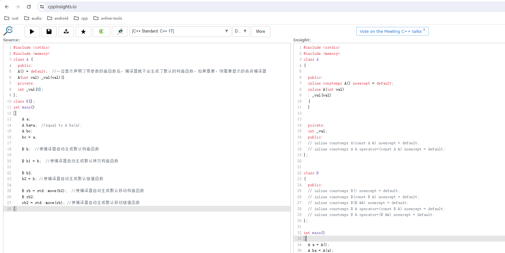

### initializer_list
### auto
### range-based for loop
### nullptr
  - 可以解决参数为指针，int型的函数重载时的ambiguity问题
### enum class
  - 相比于之前的enum类型(只是一个int类型)，strongly typed enum, more safer
### static_assert
  ```
  //run-time assert
  assert(mypointer);
  //compile time assert (c++11)
  static_assert(sizeof(int) == 4);
  ```
### Delegating constructors
  ```
  //before c++11
  class A {
    public:
        A() {init();}
        A(int val) {
            init(); 
            otherThings(val);
        }
    private:
        void init();
  };
  //before c++11
  class A {
    public:
        A(){}
        A(int val) {
            A{};  
            otherThings(val);
        }
  };
  //c++11
  class A {
    public:
        A(){}
        A(int val):A() {otherThings(val);}
  }
  ```
- non-static member initialization
  ```
    class A {
    private:
        int _value{10};
    };
  ```
### override, final关键字
 - 在重写virtual函数时添加上这个关键字，防止因为typo error意外创建新的函数
 - final:for virtual function and for class, class:can not be derived, function: can not be override
### default, delete函数
 - default
  ```
  class dog {
    dog(int age){}
  };
  dog d; //compile error: compiler will not generate the default constructor

  //c++11, default
  class dog {
    dog(int age){}
    dog() = default; //For compiler to generate the default constructor
  }
  ```
 - big 3, big 5 
    

 - 对于不想让编译器自动生成的函数，可以用delete限定符
### constexpr
 - force the computation to happen at compile time.
  ```
  //write faster program with constexpr
  constexpr int cubed(int x) { return x*x*x;}
  int y = cubed(1789);
  ```
### string literals
 - user defined literals: <return> operator"" <suffix>(<parameters>);
   - it can only work with following parameters:
      ```
      char const *
      unsigned long long
      long double
      char const*, std::size_t
      wchar_t const*, std::_size_t
      char16_t const*, std::size_t
      char32_t const*, std::size_t
      ```
      return value can be be any types
  - suffix must start with underscore `_`
- 标准库提供的字面量都不带下划线"_"
### lambda function
- 函数式编程范式
### Rvalue Reference
- https://www.youtube.com/watch?v=UTUdhjzws5g&t=4s&ab_channel=BoQian
- https://www.youtube.com/watch?v=0xcCNnWEMgs
- lvalue, rvalue
  - lvalue:An object that occupies some identifiable location in memory
  - rvalue:Any object that is not a lvalue
- moving semantics
- perfect forwarding:rvalue is forwarded as rvalue, lvalue is forwarded as lvalue.
- Reference Collapsing Rules(c++11)
  - T& & => T&
  - T& && => T&
  - T&& & => T&
  - T&& && => T&&
- template <typename T> struct remove_reference;   
  - it removes reference on type T
  - remove_reference<int&>::type i;  //int i
  - remove_reference<int>::type i: //int i;
- T&& is Universal Reference: rvalue, lvalue, const, non-const, etc.
  when 
  - T is a template type
  - Type deduction(reference collasping) happens to T
     - T is a function template type, not class template type.
  - int&& => rvalue, T&& => universal reference.
- std::move vs std::forward
  - std::move<T>(arg); //Turn arg into rvalue type
  - std::forward<T>(arg); //Turn arg to type of T&&

### Compiler Generated Functions
- C++03
   ```
   1.default constructor(generated only if no constructor is declared by user)
   2.copy constructor(generated only if no 5,6 declared by user)(c++11: 3,4,5,6)
   3.copy assignment operator(generated only if no 5,6 declared by user) (c++11: 2,4,5,6)
   4.destructor
   ```
- C++11
  ```
   5.move constructor(generated only if 2,3,4,6 not declared by user)
   6.move assignment operator(generated only if 2,3,4,5 not declared by user)
  ```
- class Dog{}; is equivalent to something like below
  ```
  class Dog {
    //c++03
    Dog();
    Dog(const Dog&);
    Dog& operator=(const Dog&);
    ~Dog();

    //c++11
    Dog(Dog&&);
    Dog& operator=(Dog&&);
  };
  ```
- Test
  ```
  class Cat {//3,4 will be generated (3 is deprecated)
    Cat(const Cat&){} //copy constructor
  };
  class Duck { //4
    Duck(Duck&&) {} //move constructor
  };
  class Frog { //4
    Frog(Frog&&, int=0) {} //move constructor
    Frog(int=0){} //default constructor
    Frog(const Frog&, int=0) {} //copy constructor
  };
  class Fish{ //1,2,3(c++11:2,3 are deprecated)
    ~Fish(){}
  };
  class Cow { //1,2,4 (c++11: 2 is deprecated)
    Cow& operator=(const Cow&) = delete;  //delete statement is still counted as delcared by user
  };
  ```
### smart_ptr
- An object should be assigned to a smart pointer as soon as it is created,  Raw pointer should not be used again. `std::make_shared, std::make_unique`
- shared_ptr:std::make_shared
- weak_ptr:resolve cyclic reference.
  - weak_ptr has no ownershipo of the pointed object.
  - I only want to access that object, when and how that object will be delete is none of my business.
  - weak_pointer is similar to raw pointer, but it also provide one level protection that object an not be deleted through weak_ptr
  - weak_pointer also provide safe access to the pointer.weak_ptr is not always valid,
   before you use it, you need to call .lock() to create a shared_ptr from it.
- unique_ptr: exclusive ownership, light weighted smart pointer
  - unique_ptr.release() give up the ownership, while shared_ptr.get() doesn't give up the ownership

### Regex