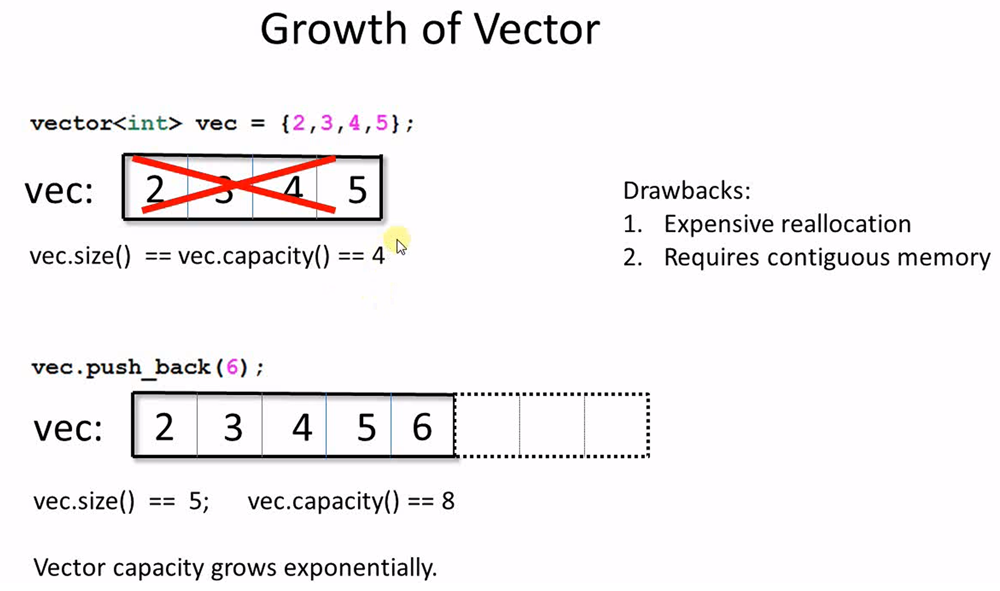
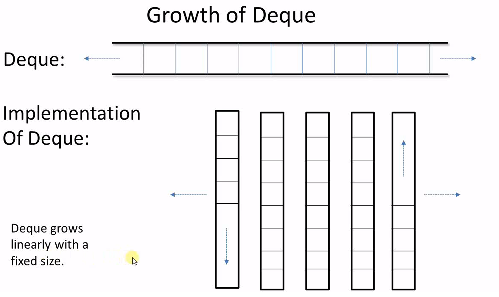

### Containers member functions vs algorithms
- Member Functions with same name as in algorithm:
  ```
  //List
  void remove(const T); template<class Comp> void remove_if(Comp);
  void unique();        template<class Comp> void unique(Comp);
  void sort();          template<class Comp> void sort(Comp);
  void merge(list&);    template<class Comp> void merge(Comp);
  void reverse();

  //associative containers:
  size_type count(const T&) const;
  iterator find(const T&) const;
  iterator lower_bound(const T&) const; 
  iterator upper_bound(const T&) const; 
  std::pair<iterator, iterator> equal_range(const T&) const;
  //Note: they don't have generialized form, because comparison is defined by the container.

  //unordered container
  size_type count(const T&) const;
  iterator find(const T&) const;
  std::pair<iterator, iterator> equal_range(const T&) const;
  //Note: No generalized form; use hash function to search
  ```
- why? same function exist as member function and algorithm function?
  > same purpose, but they do things in a different way, they're not equal because one way is better than the other
  - there are duplicated functions between container's member functions and algorithm functions
  - in general, perfer member functions over algorithm functions with the same names.except
    - find of std::set, see next section **Equivalence vs Equality**
### Tricky reverse iterator
  reverse_iterator and iterator can be converted to each other,
  but they don't point to the same element, they're off by one item.
  iter -> riter: (-1), riter -> iter: (+1)
  
  ```
  std::vector<int>::reverse_iterator ritr;
  std::vector<int>::iterator it;

  riter = std::vector<int>::reverse_iterator(it);
  it = riter.base();
  ```
### Equivalence vs Equality
  - find in std::set for algorithm and member function
    - algorithm std::find() looks for equality if (x==y)
    - std::set::find() looks for equivalence: if (!compare(x,y) && !compare(y,x))
  - GuideLines:
    - if the function is using operator "<"(compare) or it's like, it's checking equivalence, typically it's algorithm that works with sorted data, or a member function of a container with sorted data, such as associative container.
    - if the function is using operator "==" or it's like, it's checking equality, typically the data is not required to be sorted.
      ```
      //algorithm of equality
      std::search
      std::find_end
      std::find_first_of
      std::adjacent_search

      //algorithms of equivalence
      std::binary_earch
      std::includes
      std::lower_bound
      std::upper_bound
      ```
    - Summary: when using a function to search or remove certain element, make sure you understand the difference between equality and equivalence
### Removing elements
  - vector or deque: algorithm remove() followed by member function erase()
  - List: member function remove()
  - associative container or unordered container:erase()
  - remove and do something else?
    - sequence container and unordered container: `iter = c.erase(iter)`
    - associative container: `iter= c.erase(iter) or c.erase(iter++)`
### Vector vs Deque
  - growth of vector 
  
    每次加item时都可能有内存重分配，数据copy的操作(动态扩容，以一定的系数，不同的实现系数不一样,常见的是2,即内存按2X增长)
  - vector:Strategy of minimizing reallocation:
    - if the maximum number of item is know, reserve(MAX);
    - if the end of grown is known, reserve as much memory as we can, once all data are inserted, trim off the rest. 
      ```
      vec.shrink_to_fit(); //c++11
      std::vector<int>(vec).swap(vec); //c++03
      ```
  - growth of deque
    
    - no reallocation, deque has no reserve() and capacity()
    - slightly slower than vector, because of 
      - more complex data structure
      - locality
  - Deque or vector, which one to use?
    - 1.general guildeline
      - Need to push_front a lot? -> deque
      - Performance is important? -> vector
    - 2.Element type:when the elements are not of a trivial type(build-in data type), deque is not mush less efficient than vector.
      - the cost of construction and destruction dominate the performance, the performance of the container themselves becomes less important.
    - 3.Memory Availability,could allocation of large contiguous memory be a problem?, if yes, then use deque
      - limited memory size
      - large trunk of data
      - memory fragmentation
    - 4. Frequency of unpredictable growth -> deque
    - 5. Invalidation of pointers/references/iterators because of growth
    - 6. Vector's unique function:portal to C
      ```
      std::vector<int> vec{2,3,4,5};
      void c_fun(const int* arr, int size);
      c_fun(&vec[0], vec.size());

      //passing data from a list to C
      std::list<int> mylist;
      ...
      std::vector<int> vec(mylist.begin(), mylist.end());
      c_func(&vec[0], vec.size())
      
      //Note:&vector[0] can be used as a raw array
      //Exception:std::vector<bool>
      void cpp_fun(const bool* arr, int size);
      std::vector<bool> vec{true, true, false, false};
      cpp_fun(&vec[0], vec.size()); //compile error:&vec[0] is not a bool pointer
      //workaround: use std::vector<int> or bitset
      ```
  - summary:
    - Frequent push_front() -> deque
    - Build-in data type -> vector
    - Not build-in data type -> deque
    - large Contiguous memory challenge -> deque
    - unpredictable growth -> deque
    - pointer integrity -> deque
    - frequently passed to C -> vector 
### Object Slicing
