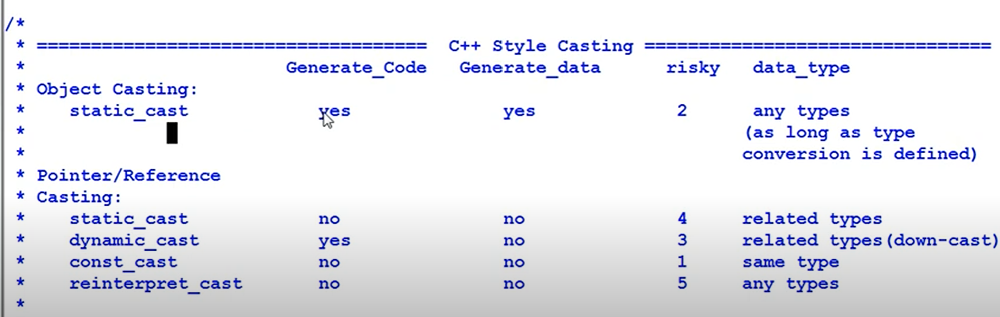
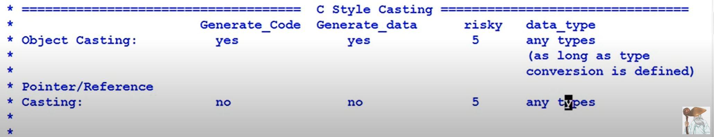

### const
- A **compile time constraint** that an object can not be modified
- why use const
  - guard against inadvertent write to the variable
  - self documenting
  - enable compiler to do more optimization, making code tighter
  - const means the variable can be put in ROM
### compiler generated functions
//这个是c++11以前的，在c++11中的新feature可以查看4.cpp11中的notes.md

- compiler silently writes 4 functions if they are not explicitly declared
    - default constructor(only if there is no constructor declared)
    - copy constructor
    - copy assignment operator
    - destructor
    ```
    class dog{};
    //equivalent to 
    class dog {
    public:
        dog() {...} // 1.call base class's defaut constructor
                    //2. call data member's default constructor
        dog(const dog&){...} //member by member initialization
        dog& operator=(const dog&){...} //member by member copying
        ~dog(){...} //1.call data member's destructor.
                    //2.call base class's destructor
    };
    ```
- if base class/member variable's class don't meet the requirements, then the default function would not be generated either.for example, if base class don't have default construct, then default construct will not be generated for this class because there's no way to do default constructor's job;
- all generated functions are public and line
- all generated functions are generated **only** if they are needed.
- c++11中，可以通过=default来显式让compiler生成default function,例如，自定义了带参数的constructor, compiler就不会自动生成默认的无参数的default constructor, 可以通过default显式生成。
- comipler generated functions are not alawys useful, sometime they're dangerous,
  how to prevent compiler generate those functions:before c++11, delcare it as private with out function body. from c++11, use `=delete`
- summary of disallowing functions
  - c++11: f() = delete;
  - c++03: Declare the function to be private, and not define it.
  - private destructor: stay out of stack
    ```
    //force Dog can only be created to stack, useful for limited stack size such as embedded programming
    class Dog {
    public:
        void destroyMe() {delete this;}
    private:
        ~Dog();
    };

    void dog_test {
        Dog* p = new Dog;
        p->destroyMe();
    }
    ```
### Virtual Destructor and Smart Destructor
- 带virtual function的base class都需要将destructor声明为virtual
- 当class object作为shared_ptr的polymorphic使用时，可以不用声明为virtual
- All classes in STL have no virtual destructor, so be careful inheiriting from them. if you have to do that, use share_ptr to use that object as much as possible.
### Preventing Exceptions from Leaving Destructors
Solutions
- Solution 1: Destructor swallow the exception
  ```
  ~dog() {
    try {
        //enclose all the exception prone code here
    } catch (MYEXCEPTION e) { //catch exception
    } catch (...) { //be careful of this
    }
  }
  ```
- Solution 2:move the exception-prone code to a different function, leave the destructor expcetion-free.
  ```
  ~dog{} {std::cout << "destroyed" << std::endl; throw 20;}

  //TO

  ~dog() {std::cout << "destroyed" << std::endl;}
  void prepareToDestruct() {//do somthing that might throw exception}
  //when use, call prepareToDestruct() before it get destroyed.

  ```
### Calling Virtual Function in Constructor or Destructor
- DO NOT call any virtual function in constructor or destructor
### Assignment to Self in Assignment Operator
### RAII:Resource acquisition is initialization
use objects to manager resources:memory, hardware device, network handle, etc.
- Conclusion: 
  - the only code that can be guaranteed to be executed after exception is thrown are the destructor of objects residing on the stack.
  - resource management therefore needs to be tied to the lifespan of suitable objects in order to gain automaic deallocation and reclamation.
- std::shared_ptr
  ```
  class dog;
  class Trick
  void train(std::shared_ptr<dog> pd, Trick dogtrick);
  Trick getTrick();

  //Question: what's the problem with below line code
  train(std::shared_ptr<dog>(new dog()), getTrick());

  //what Happens in train()'s parameter passing:
  //1.new dog()
  //2.getTrick()
  //3.construct std::shared_ptr<dog>
  //the order of these operations are determined by compiler, if step2 throws an exception, step2 will not be executed. memory of step 1 will be leaked
  
  //conclusion: Don't combine storing objects in shared pointer wit other statements.
  //use std::make_shared instead
  //or
  std::shared_ptr<dog> pd(new dog());
  train(pd, getTrick());
  ````
- what happens when resource management object is copied?
  - solution 1: prohibit copying, disallow copy constructor and copy assignment operator from being used
  - solution 2:reference-count the underlying resource by using std::shared_ptr, `template <class Other, class D>shared_ptr(Other *ptr, D deleter);`, a deleter is a function that will be invoked when the shared pointer is destroyed, the default value for D is delete. deleter can be customized
    ```
    class Lock {
    public:
      explicit Lock(Mutex_t *pm):_pMutex(pm, Mutex_unlock){
        Mutex_lock(pm);
        //the second parameter of shared_ptr constructor is "deleter" function.
      }
    private:
      std::shared_ptr<Mutex_t> _pMutex;
    };
    {
      Lock L1(&mu);
      Lock L2(L1);
    } //mu will be unlocked here
    
    ```
### STATIC INITIALIZATION FIASCO
- global object的创建顺序是未知的，如果某个object在被实际创建出来被使用，程序可能crash, heirish:在本地测试时没crash,是编译器修复这个问题了?虽然没crash,但是在Dog的constructor调用c.meow()时，打印出的_name名字是空的
  - 没重现是因为用std::string _name,如果是char* _name.由于在Dog constructing时，c还未被创建。因此调用c的meow时，c._name还是空指针,在打印的时候就会crash了
- solution:singleton
  ```
  class Singleton {
  public:
    static Dog& getDog() {
      static Dog d;
      return d;
    }
    static Cat& getCat() {
      static Cat c;
      return c;
    }
  };
  在使用时,Singleton::getDog().fun(); Singletone::getCat().fun();就能保证函数在使用时是有对应的object的
  ```
### Struct Vs. Class
- Struct: small passive objects that carry **public data** and have no or fiew basic member functions, used for data container
- Class: Bigger active objects that carry **private data**, interfaced through public member functions, used for more complex data structure.
- above is just convention, you can also manually delcare private data member for structure, public data member for class.
- the only technical differtence is the default accessibility, then there effectively is no real difference between them
### Resource Managing Class
Class owns some object through its pointer
- solution 1: define copy constructor and copy assignment operator for deep copying.
- solution 2: delete copy constructor and copy asignment operator,define clone function ->prefer: because rare case we need those, except we need to use then in container which requires copy capability, but we can solve this simply by saving pointer of object in container
  ```
  class Dog {
  public:
    virtual Dog* clone() {return new Dog(*this);} //co-variant return type
  };
  class YellowDog:public Dog {
    virtua YellowDog* clone() return new YellowDow(*this);
  };
  void foo(Dog* dog) //YellowDog
  {
    //Dog* d = new Dog(*dog); //Dog
    Dog* c = dog->clone(); //YellowDog
  }

  YellowDog d;
  foo(&d);
  ```
- above is solution before c++11. after c++11, you can manage the resource using std::shared_ptr
### Implicit type conversion
- Implicit User defined type conversion:**Defined inside class (user defined type)**,There are 2 methods to define implicit user type conversion:
  - 1.Use constructor that can accept a single parameter. - convert other types of object into your class
  - 2.Use the Type conversion function. - convert an object of your class into other types
- PRINCIPLE:make interface easy to user correctly and hard to use incorrectly, How hard is enough?Ideally, uncompilable. General guideline
  - avoid defining seemingly unexpected conversion.
  - avoid defining two-way(a->b, b->a) implicit conversion.
### All casting considered
- type conversion:
  - implicit type conversion
  - explicit type conversion - casting.
- c++ styple cast:static_cast, dynamic_cast,const_cast,reinterpret_cast
- Generally c++ style of casts are preferred over the c-style, because
  - Easier to identify in the code.
  - Less Usage error.C++ style provides:
    - a.Narrowly specified purpose of each cast, and
    - b.Run-time type check capatility.
- summary
  
  
  - generate code: the cast will invoke the cast function(method 2) or the constructor of the casted type(method 1)

### Inheritance Basics
  ```
  class B {};
  class D_priv: private B{};
  class D_prot: protected B{};
  class D_pub: public B{};
  ```
- public,protected,private inheritance: then specifies the different access control from the derived class to the base class.
  - None of the derived class can access anything that is private in base class
  - D_pub inherits public members of B as public and the protected members of B as protected
  - D_priv inherits the public and protected members of base class as private
  - D_prot inherits the public and protected members of base class as protected.
- Casting:
  - Any one can cast a *D_pub to B*, because public derived class **is a** special kind of base class
  - D_priv's members and friends can cast a D_priv* to B*
  - D_prot's members, friends and children can cast D_prot* to B*.
- public inheritance: is-a relation
- private inheritance: similar to has-a relation(composition). but generally compositon is a better choice
- Inheritance is often usefull, but more often overused(obused) <----see below related inheritance related points
### Maintain is-a relation for public inheritance
- "is-a" relation: a derived class should be able to do everything the base class can do
- summary:
  - Precise definition of classes
  - Don't override non-virtual functions.
  - Don't override default parameter values for virtual functions
  - For inheritance of shadowed functions.
### Understanding Rvalue and Lvalue
- notes and code are also available in 4.cpp11
### Static Polymorphism
- Polymorphism:
  - is-a relationship between base class and derived class
  - Base class defined "generic" algorithm that's used by derived class
  - The "generic" algorithm is customized by the derived class
- dynamic polymorphism is not free, cost
  - memory: for virtual table
  - run-time: dynamic binding
- Curiously recurring template pattern(static polymorphism, simulated polymorphism)
  - Free Lunch?no, program image size cost.
  - Generalized Static polymorphism
    ```
    tempalte <typename T>
    T Max(std::vector<T> v) {
      T max = v[0];
      for(typename std::vector<T>::iterator it = v.begin(); it!=v.end(); ++it) {
        if (*it > max) {
          max = *it;
        }
      }
      return max;
    }
    ```
- TMP: template meta programming
  the idea of TMP is, it moves part of the computation with typically happlens during run-time up front to the compile time.
  therefore improves the efficiency of your program.
### Multiple Inheritance:Devil or Angel
- Interface Segregation Principle
  
  split large interfaces into smaller and more specific ones so that clients only need to know about the methods that are of interest to them
- Diamond inheritance problem
  - duplication of data <- solution: virtual derive from base class
  - duplication of function <- solution: virtual derive from base class
  - problem of initialization <- solution: most derived class responsible for initializing most base class
- Pure Abstract Classes

  Abstract Class: A class has one or more pure virtual functions

  Pure Abstract Class
  - no data
  - no concrete functions
- Summary:
   - Multiple Inheritance is an important technique, e.g. ISP
   - Derived only from PACs when using Multiple Inheiritance. <-- all that problems in diamond inheritance will disappear
### The duality of public inheritance
- duality:双重性，二元性
  - inheritance of interfaces
  - inheritance of implementaion
- Types of Inheritance in C++:
  - 1.Pure virtual public function - inherit interface only
  - 2.Non-virtual public function - inherit both interface and implementation
  - 3.Impure virtual public function - inherit interface and default implementation
  - 4.protected function - inherit implementation only
    ```
    class Dog {
      public:
          virtual void bark() = 0; 
          void run() {std::cout << "I am running.\n";} //2. in YellowDog
          virtual void eat() {std::cout << "I am eating.\n";} //3 in YellowDog
      protected:
          void sleep() { std::cout << "I am sleeping.\n";}
      };
      class YellowDog:public Dog {
      public:
          virtual void bark() {std::cout << "I am a yellow dog.\n";} //1
          void iSleep() {sleep();} //4
      };
    ```
- As a software designer, it is very imiportant to separate the concepts of interface and implementation
- When to use which?
  - Interface Inheritance
    - when:Subtyping, Polymorphism
    - pitfalls:be careful of interface bloat, interfaces do not reveal implementation
  - Implementation Inheritance
    - when: generally not encouraged.
    - pitfalls:increase code complexity
    - guidelines for implementation inheritance:
      - do not use inheritance for code reuse, use composition <-----move the common code to a helper class, and both derived class and base class should own that helper
      - minimize the implementaion in base classes, base classes should be thin
      - minimize the level of inheritance in in implementation inheritance.
### Code reuse:inheritance vs. composition

composition is better than inheritance
- 1.less code coupling between reused code and reuser of the code.
  - Child classs automatically inherits all parent class's public members
  - Child class can access parent's protected members, so inheiritance breaks encapsulation
    - friends and children, the biggest enemy of your privacy.
- 2.Dynamic binding
  - inheritance is bounded at compile time
  - composition can be bounded either at compile time or at run time.
    ```
    class Activity{};
    class Dog {};
    class BullDog:public Dog{
      Activity* _pActivity;
    };
    class SheperDog:public Dog {
      Activity* _pActivity;
    };
    class OutDoorActivity:public Activity{};
    class IndoorActivity:public Activity{};
    ```
- 3.Flexible code construct
  ```
  Dog       Activity
  BullDog   OutDoorActivity(1 or more)
  Sheper    InDoorActivity(1 or more)
  ```
### Namespace and the name lookup
- using
  - 1.using directive: to bring all namespace members into current scope:`using namspace std;`
  - 2.using delcaration:
    - a.bring one specific namespace member to current scope:`using std::cout;`
    - b.bring a member from base class to current class's scope:`using Dog::bark;`
  - Example
    ```
    using namespace std; //case 1, global scope
    using std::cout; //case 2.a, global scope

    class B {
    public:
      void f(int a);
    };
    class D:private B {
    public:
      void g() {
        using namespace std; //case 1, local scope
        cout << "From D:\n";
      }
      void h(){
        using std::cout; //case 2.a,local scope
        cout << "From D:\n";
      }
      using B::f; //case 2.b,class scope
      using std::cout; //illegal
      using namespace std; //illegal
    };

    using B::f; //illegal
    ```
    ```
    class B{
    public:
      void f(int a);
    };
    class D:public {
    public:
      using B:f; //overcome shadowed f(int)
      void f();  
    };
    D d;
    d.f(8);
    ```
  - Anonymouns Namespace: 
    - 与static defined function作用类似，Anonymouns namespace里的函数只能在当前文件中使用
    - 如果文件中有与Anonymouns namspace内定义的函数同名的的global function, 在namespace内会优先调用本地的
      ```
      void g();
      namespace {
        void g();
        void h() {g();} //这里的g()调用的的namespace内的
      }
      h();
      ```
- Koenig Lookup: Argument dependent lookup(ADL)
  - compiler will not only search for one function in current scope and global scope, it will also search in function's parameter defined **namespace** too.
  - but let compiler do the Koenig lookup is bad programming practice, you should delcare clearly which function you're actually calling
  - For more in depth information on how ADL came to be, I suggest searching for a great blog entry by Andrew Koenig on Dr. Bobb's website.
  - Why Koenig lookup?
    - practical reason
      ```
      std::cout << "Hi.\n"; //calls std::operator<<
      ```
### demistifying operator new/delete
- `dog *pd = new dog();`
  - step 1.operator new is called to allocate memory
  - step 2.dog's constructor is called to create dog.
  - step 3, if step 2 throws an exception, call operator delete to free the memory allocated in step 1
- `delete pd;`
  - step 1.dog's destructor is called.
  - step 2.operator delete is called to free the memory
- why do we want to customize new/delete
  - 1.Usage error detection:
    - memory leak detection/garbage collection
    - array index overrun/underrun.
  - 2.Improve efficiency:
    - a.clustering related objects to reduce page fault.
    - b.fixed size allocation (good for application with many small objects).
    - c.aglign similar size objects to same places to reduce fragmentation.
  - 3.Perform additional tasks:
    - Fill the deallocatied memory  with 0's - security.
    - collect usage statistics.
  - ... //many other usage scenario
- writing a good memory manager is HARD! before writing your own version of new/delete, consider:
  - tweak your comipler tward your needs.
  - search for memory management library, E.g. Pool library from Boost
- new handler: is a function invoked when operator new failed to allocate memory, it's purpose is to help memory allocation to succeed
  - set_new_handler() installs a new handler and returns current new handler.
    ```
    void* operator new(std::size_t size) throw(std::bad_alloc) {
      while (true) {
        void* pMem = malloc(size); 
        if (pMem) return pMem; // return the memory if successful

        std::new_handler Handler = std::set_new_handler(0); //Get new handler
        std::set_new_handler(Handler); 

        if (Handler) {
          (*Handler)(); //invoke new handler
        } else {
          throw std::bad_alloc(); //if new handler is null, throw exception
        }
      }
    }
    ```
  - null by default.
  - the new handler must to do one of following things
    - 1.make more memory available
    - 2.install a different new-handler
    - 3.uninstall the new-handler (passing a null pointer)
    - 4.throw an exception bad_alloc or its descendent.
    - 5.terminate the program.