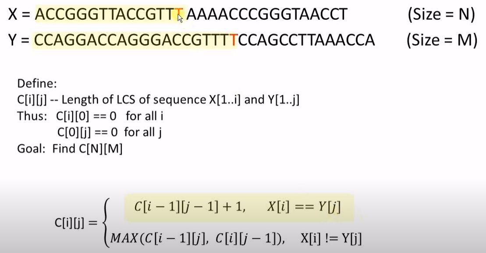
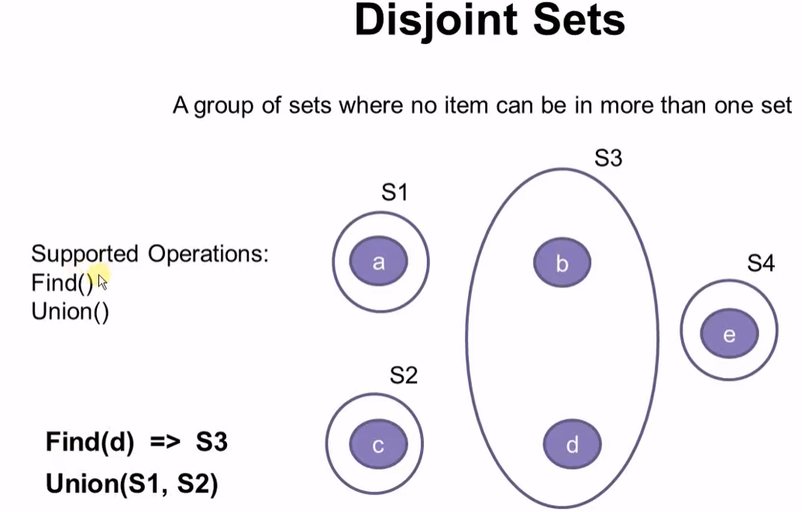
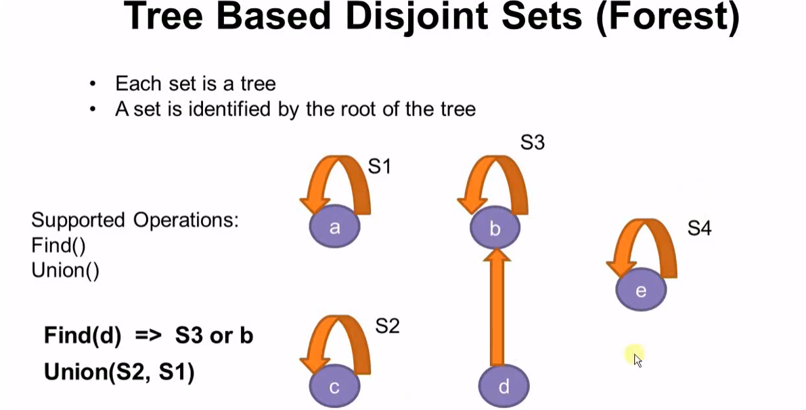
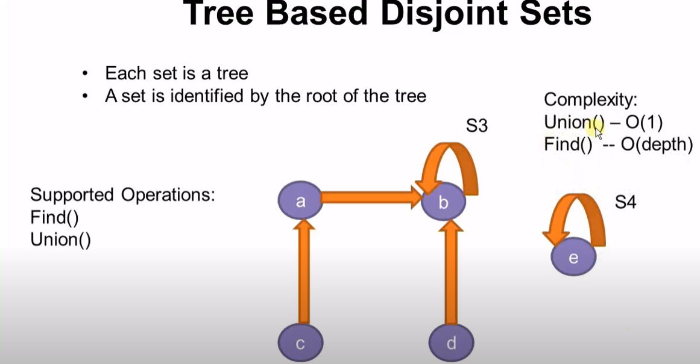
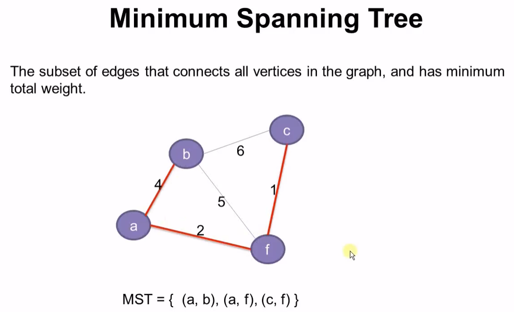
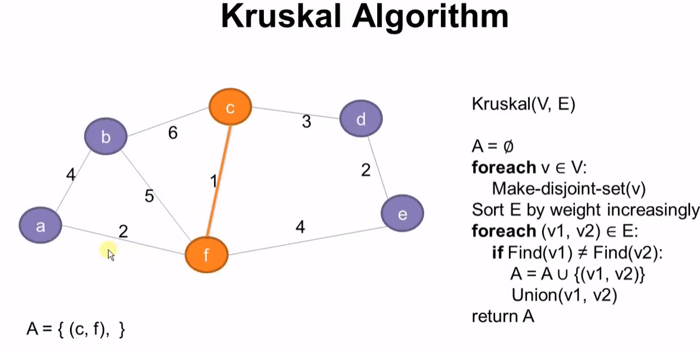

### Dynamic Programming: Longest Increasing Subsequence
- Problem: For a vector D of size N, find it's LIS
- Example:{3,2,6,4,5,1}, 
  - increasing subsequence:{3,6}, {3,4,5}, {2,6}, {2,4,5}, {1}
  - output:{2,4,5}
- Dumb Algorithm:
    ```
    for(int i=N; i>0; i--) {
        find all subsequence of D with length if i; //Cn(i)
        if (there is one increasing subsequence) 
            break;
    } //complexity = O(2^N)
    ```
- Dynamic Programming
  - idea: sacrifycing some of the space to substantially reduce the time complexity
    ```
    Define vector L: 
        L[i] : a vector, LIS of D that ends with D[i]
        L[0] = {D[0]}
    Example: {3,2,6,4,5,1}
    L[0]: {3}
    L[1]: {2}
    L[2]: {2,6}
    L[3]: {2,4}   //{3,4}也是，相同大小的取后面的
    L[4]: {2,4,5} //{3,4,5}也是，相同大小的取后面的
    L[5]: {1}

    =>
    formula: L[i] = MAX(L[j]|j<i, D[j] < D[i]) + "D[i]"
    complexicy: O(N^2)
    ```
### Dynamic Programming:Longest Common Subsequence
- Example:
    ```
    X = ACCG
    Y = CCAGCA

    CS of length 1: {A}, {C}, {G}
    CS of length 2: {AC}, {CC}, {CG}, {AG}
    CS of length 3: {CCG}
    CS of length 4: {}

    output: {CCG}
    ```
- Dumb Algorithm
    ```
    X = ACCGGGTTACCGTTTAAAACCCGGGTAACCT  (size=N)
    Y = CCAGGACCAGGGACCGTTTTCCAGCCTTAAACCA (size = M)
    N < M
    for(int i=N; i>0; i++) {
        Find all subsequence of X with length of i; //CN(i) = N!/i!(N-i)!
        Find all subsequence of Y with length of i; //CM(i)
        if (there is a common subsequence)
            break;
    } //complexity: sum of CN(i) for i=1 to i = N => O(2^N)
    ```
- Dynamic Programming
    ```
    X = ACCGGGTTACCGTTTAAAACCCGGGTAACCT  (size=N)
    Y = CCAGGACCAGGGACCGTTTTCCAGCCTTAAACCA (size = M)

    Define:
    C[i][j]: Length of LCS of sequence X[1..i] and Y[1..j]
    Thus:   C[i][0] == 0 for all i
            C[0][j] == 0 for all j
    Goal: Find C[N][M]

    Q: how to compute C[i][j] with bigger i,j using smaller i,j
    ```
    
    complexity: O(N^2)
### Disjoint Sets



- implementation:
  - 1.data with a pointer points to it's parent
    ```
    struct Item {
        char data;
        Item* parent;
    };
    ```
  -  use hashtable
- performance improve of Find() operation, to reduce the depth of the tree: when do Union, always choose the root of the deeper tree to be the new root.

### Minimum Spanning Tree:Kruskal Algorithm
- implemented with disjoint sets;
- Problem:最小跨度树， 连接所有节点的最小路径
  
- Kruskal Algorithm
  
  - 将所有vertices创建成disjoint set数据结构， 一个vertice一个set
  - 将所有edge按权重从小到大进行排序
  - 在disjoint set中找edge对应的两个vertice
    - 如果不在同一个set, 则union这两个set, 并将这条路径加到结果中
  - Walk Trough:
    - Init: A = {}
    - Step 1: A = {(c,f)} //weigth 1
    - Step 2: A = {(c,f), (a,f)} //weigth 2
    - Step 3: A = {(c,f), (a,f), (d,e)} //weigth 2
    - Step 4: A = {(c,f), (a,f), (d,e), (c,d)} //weigth 3
    - Step 5: A = {(c,f), (a,f), (d,e), (c,d),(a,b)} //weigth 4
    - Step 6: A = {(c,f), (a,f), (d,e), (c,d),(a,b)} //weigth 4, e,f is already in the same set
    - Step 7: A = {(c,f), (a,f), (d,e), (c,d),(a,b)} //weigth 5, b,f is already in the same set
    - Step 6: A = {(c,f), (a,f), (d,e), (c,d),(a,b)} //weigth 6, b,c is already in the same set
- complexity: dominated by std::sort, O(N*logN)
### Minimum Spanning Tree: Prim Algorithm