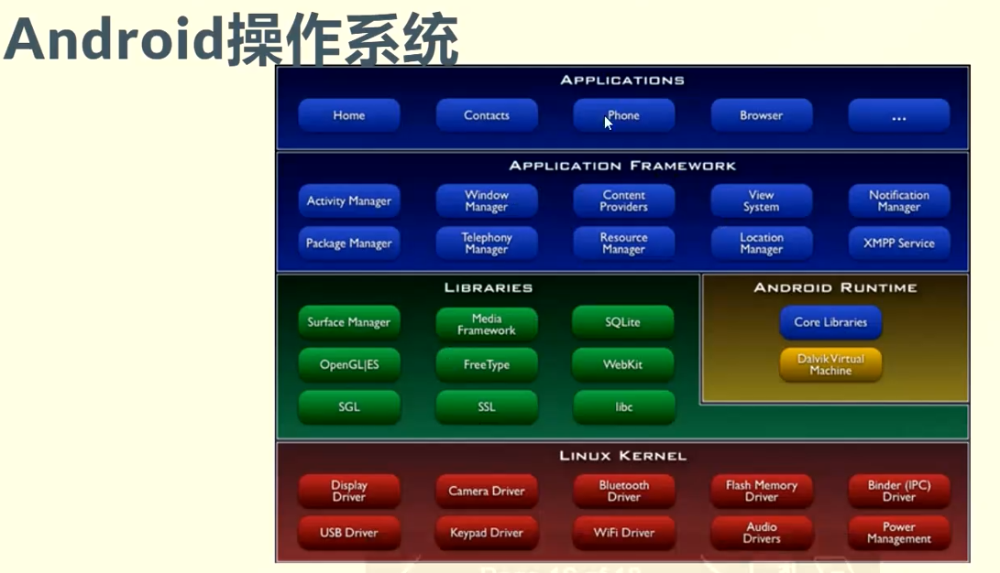

### Os
- Unix:BSD

- Linux:国内有huawei, ali, tencent, 字节等都在做自己的os

- Mac Os
- Windows
- Android

- Fushsia
### OS architecture
- 简单结构: MS-DOS, 应用和OS混在一起
- 单体分层结构: 将单位操作系统(Monolithic OS)划分为多层(levels)
- 微内核结构(MicroKernel):尽可能把内核功能移到用户空间，用户模块间的通信使用消息传递。
- 外核结构: 让内核分配物理资源给多个应用程序，并让每个程序决定如何处理这些资源，libOS, DSM(Distributed Shared Memory)
- 虚拟机结构： 虚拟机管理器(VMM)将单独的机器接口转换成很多的虚拟机(VMs).
### reference books
- operating system: three easy pieces: https://pages.cs.wisc.edu/~remzi/OSTEP/#homework
- 清化camp课件:https://learningos.cn/os-lectures/#1
- https://hansimov.gitbook.io/csapp
- [训练营实验流程](./learningos.cn_os-lectures_lec2_p1-labintro.html.pdf)